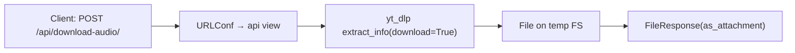

# API layer for `download_audio`

Short answer: **No, your current project does not expose a REST/HTTP API for `download_audio`**—it only handles a browser POST via the HTML form (`views.index`). Below are two tiny options you can paste in to add an API quickly.

---

## Option A — Vanilla Django JSON endpoint (no DRF)
**Goal:** POST a JSON body with a YouTube URL and get back a download **file** (synchronous) or an error JSON.

### 1) `audio_dl/api_views.py`
```python
# audio_dl/api_views.py
import glob, os, tempfile
from django.http import JsonResponse, FileResponse, HttpResponseBadRequest
from django.views.decorators.csrf import csrf_exempt
from django.views.decorators.http import require_POST
from yt_dlp import YoutubeDL
import json

@csrf_exempt  # remove if you use a CSRF token/session
@require_POST
def download_audio_api(request):
    try:
        payload = json.loads(request.body.decode("utf-8"))
    except Exception:
        return HttpResponseBadRequest("Invalid JSON body")

    url = (payload.get("url") or "").strip()
    if not url:
        return HttpResponseBadRequest("Missing 'url'")

    tmpdir = tempfile.mkdtemp(prefix="yt_")
    outtmpl = os.path.join(tmpdir, "%(title)s.%(ext)s")
    ydl_opts = {
        "outtmpl": outtmpl,
        "format": "bestaudio/best",
        "noplaylist": True,
        "quiet": True,
        "nocheckcertificate": True,
    }

    with YoutubeDL(ydl_opts) as ydl:
        info = ydl.extract_info(url, download=True)
        filepath = ydl.prepare_filename(info)

    if not filepath or not os.path.exists(filepath):
        files = glob.glob(os.path.join(tmpdir, "*"))
        if not files:
            return HttpResponseBadRequest("Download failed")
        filepath = files[0]

    filename = os.path.basename(filepath)
    fileobj = open(filepath, "rb")
    return FileResponse(fileobj, as_attachment=True, filename=filename)
```

### 2) `audio_dl/urls.py` (add an API route)
```python
# audio_dl/urls.py
from django.urls import path
from . import views
from . import api_views

urlpatterns = [
    path("", views.index, name="index"),
    path("api/download-audio/", api_views.download_audio_api, name="download_audio_api"),
]
```

### 3) Example requests
```bash
# JSON → file response (Content-Disposition: attachment)
curl -X POST \
  -H "Content-Type: application/json" \
  -d '{"url": "https://www.youtube.com/watch?v=XXXXXXXXXXX"}' \
  -o out.mp3 \
  http://127.0.0.1:8000/api/download-audio/
```

> **Note:** This is synchronous and ties up the request until the download finishes. Fine for local/family use; for scale, switch to async (Celery/RQ) and return a job ID.

---

## Option B — Django REST Framework (DRF) endpoint
**Goal:** Same behavior but using DRF Request/Response + simple serializer.

### 1) Install & settings
```bash
pip install djangorestframework
```
In `settings.py`:
```python
INSTALLED_APPS = [
    # ...
    'rest_framework',
    'audio_dl',
]
```

### 2) `audio_dl/api.py`
```python
# audio_dl/api.py
import glob, os, tempfile
from rest_framework.decorators import api_view
from rest_framework.response import Response
from rest_framework import status
from yt_dlp import YoutubeDL

@api_view(["POST"])
def download_audio_api(request):
    url = (request.data.get("url") or "").strip()
    if not url:
        return Response({"detail": "Missing 'url'"}, status=status.HTTP_400_BAD_REQUEST)

    tmpdir = tempfile.mkdtemp(prefix="yt_")
    outtmpl = os.path.join(tmpdir, "%(title)s.%(ext)s")
    ydl_opts = {
        "outtmpl": outtmpl,
        "format": "bestaudio/best",
        "noplaylist": True,
        "quiet": True,
        "nocheckcertificate": True,
    }

    with YoutubeDL(ydl_opts) as ydl:
        info = ydl.extract_info(url, download=True)
        filepath = ydl.prepare_filename(info)

    if not filepath or not os.path.exists(filepath):
        files = glob.glob(os.path.join(tmpdir, "*"))
        if not files:
            return Response({"detail": "Download failed"}, status=status.HTTP_400_BAD_REQUEST)
        filepath = files[0]

    filename = os.path.basename(filepath)
    fileobj = open(filepath, "rb")
    # DRF can return a Django FileResponse directly
    from django.http import FileResponse
    return FileResponse(fileobj, as_attachment=True, filename=filename)
```

### 3) `audio_dl/urls.py`
```python
# audio_dl/urls.py
from django.urls import path
from . import views
from . import api  # DRF-based API

urlpatterns = [
    path("", views.index, name="index"),
    path("api/download-audio/", api.download_audio_api, name="download_audio_api"),
]
```

### 4) Example requests
```bash
curl -X POST \
  -H "Content-Type: application/json" \
  -d '{"url": "https://www.youtube.com/watch?v=XXXXXXXXXXX"}' \
  -o out.mp3 \
  http://127.0.0.1:8000/api/download-audio/
```

---

## Mermaid — tiny overview of API flow


---

## Next steps (pick one)
- Keep **Option A** for zero-deps minimalism.
- Use **Option B** if you plan more endpoints soon (pagination, auth, throttling, browsable API).
- If you want **non-blocking** UX later: wrap the download in a task queue (Celery/RQ/Huey) and make this endpoint return `{ job_id }`, plus a `/api/jobs/<id>/` status endpoint + a download link when ready.

