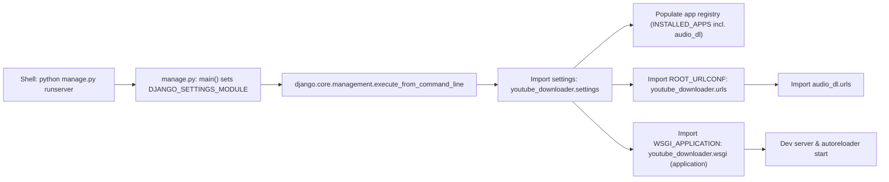
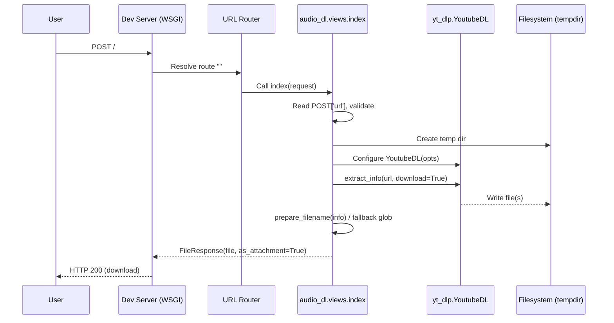
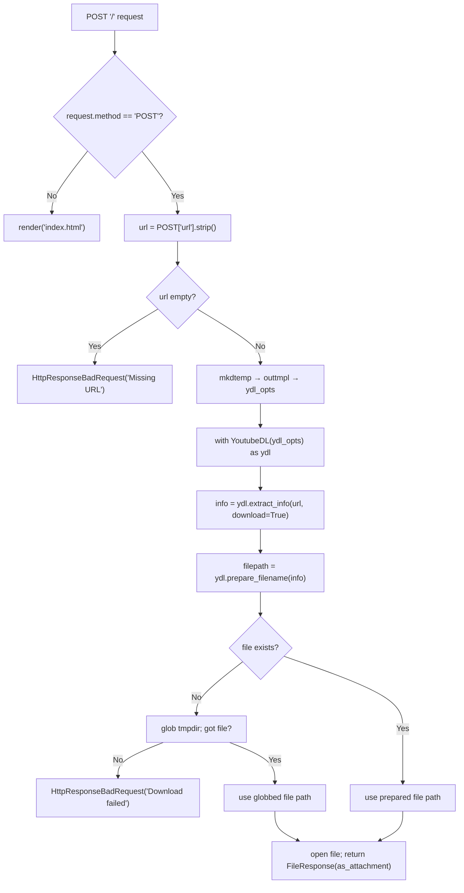
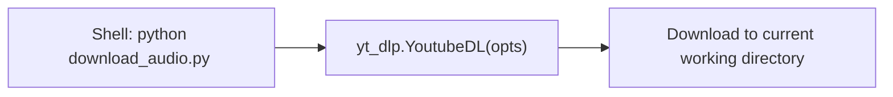

# Django YouTube Audio Downloader — Execution Flow (Study Notes)

Pedro, this is a compact, keepable reference of how your app runs. It’s split into: high‑level diagrams, then low‑level linear traces for (A) starting the dev server and (B) handling the form POST.

---

## 0) What’s in play
- `manage.py` — Django command entry point.
- Project package `youtube_downloader/`
  - `settings.py` — config, apps, middleware, URLConf, WSGI.
  - `urls.py` — includes `audio_dl.urls` at the site root.
  - `wsgi.py` — builds the WSGI `application` used by `runserver`.
  - `asgi.py` — ASGI entry (not used by dev server path here).
- App package `audio_dl/`
  - `apps.py` — `AudioDlConfig`.
  - `views.py` — `index(request)` (GET form, POST download).
  - `urls.py` — **must** route `""` → `views.index` (see fix below).
  - `templates/index.html` — form template (see fix below).
- Standalone `download_audio.py` — optional CLI downloader (independent of Django).

> If `audio_dl/urls.py` or `templates/index.html` aren’t present, add the minimal versions in section **4**.

---

## 1) High‑level: starting `manage.py runserver`

### Flowchart (import/initialization path)


### What each step means
1. **Shell executes**: `python manage.py runserver`.
2. **`manage.py`** sets env var `DJANGO_SETTINGS_MODULE` and calls `execute_from_command_line()`.
3. **Django command** resolves `runserver` and **imports settings**.
4. **`settings.py`** runs top‑to‑bottom: defines `INSTALLED_APPS`, `MIDDLEWARE`, `ROOT_URLCONF`, `WSGI_APPLICATION`, DB, TEMPLATES, etc.
5. **App registry** loads `audio_dl.apps.AudioDlConfig` and imports app modules.
6. **URLConf**: imports `youtube_downloader.urls` → includes `audio_dl.urls`.
7. **WSGI**: imports `youtube_downloader.wsgi` → builds `application`.
8. **Dev server** binds to port and starts the autoreloader.

---

## 2) High‑level: user submits the form (index view)

### Sequence (request → response)


### Decision flow (POST path only)


---

## 3) Low‑level linear traces

### A) Exact order when you run `python manage.py runserver`
1) **`manage.py`** executes `main()`: sets `DJANGO_SETTINGS_MODULE = 'youtube_downloader.settings'`.
2) Calls `execute_from_command_line(sys.argv)`.
3) Django resolves the `runserver` command.
4) **Imports** `youtube_downloader.settings`.
5) **Executes** `settings.py` top‑to‑bottom:
   - computes `BASE_DIR`, sets `SECRET_KEY`, `DEBUG`, `ALLOWED_HOSTS`.
   - defines `INSTALLED_APPS` (includes `'audio_dl'`).
   - defines `MIDDLEWARE`, `TEMPLATES`.
   - sets `ROOT_URLCONF = 'youtube_downloader.urls'`.
   - sets `WSGI_APPLICATION = 'youtube_downloader.wsgi.application'`.
   - configures `DATABASES`, static/media paths if present.
6) **App registry** initializes and imports app modules; `audio_dl.apps.AudioDlConfig` is loaded.
7) **URLConf import**: `youtube_downloader.urls` → `include('audio_dl.urls')`.
8) **`audio_dl.urls`** is imported and resolves patterns (root → `views.index`).
9) **WSGI import**: `youtube_downloader.wsgi` → `get_wsgi_application()` → creates `application`.
10) **Server loop** starts; autoreloader watches files.

### B) Exact path when user clicks the button (POST)
1) Browser sends **`POST /`** with form field `url`.
2) WSGI server passes the request to URL resolver; root matches `audio_dl.urls` → `views.index`.
3) `index(request)` runs:
   - Checks `request.method == 'POST'` → True.
   - `url = (request.POST.get('url') or '').strip()`.
   - If empty → `HttpResponseBadRequest('Missing URL.')` and **return**.
   - `tmpdir = tempfile.mkdtemp(prefix='yt_')`.
   - `outtmpl = os.path.join(tmpdir, '%(title)s.%(ext)s')`.
   - Build `ydl_opts = { 'outtmpl': outtmpl, 'format': 'bestaudio/best', 'noplaylist': True, 'quiet': True, 'nocheckcertificate': True }` (example).
   - `with YoutubeDL(ydl_opts) as ydl:`
     - `info = ydl.extract_info(url, download=True)` — **download happens here**.
     - `filepath = ydl.prepare_filename(info)`.
   - If `filepath` missing or file not found → `glob.glob(os.path.join(tmpdir, '*'))` and pick the first if present.
   - If still no file → `HttpResponseBadRequest('Download failed.')` and **return**.
   - `filename = os.path.basename(filepath)`; `fileobj = open(filepath, 'rb')`.
   - `return FileResponse(fileobj, as_attachment=True, filename=filename)` → Django streams file to client.
4) Browser receives a **download** response; save dialog opens.

---

## 4) Small fixes / minimal files

### `audio_dl/urls.py`
```python
# audio_dl/urls.py
from django.urls import path
from . import views

urlpatterns = [
    path("", views.index, name="index"),
]
```

### `templates/index.html`
```html
<!-- templates/index.html -->
<!doctype html>
<html>
  <head>
    <meta charset="utf-8" />
    <meta name="viewport" content="width=device-width, initial-scale=1" />
    <title>YouTube → Audio</title>
  </head>
  <body>
    <h1>Download YouTube Audio</h1>
    <form method="post">
      
      <input type="url" name="url" placeholder="https://www.youtube.com/watch?v=..." required style="width: 420px;" />
      <button type="submit">Download</button>
    </form>
  </body>
</html>
```

> Place `index.html` under a template path recognized by your `TEMPLATES` setting (e.g., project‑level `templates/` or `audio_dl/templates/`).

---

## 5) Optional: CLI downloader (mental model)



This CLI tool is independent; it doesn’t go through Django’s request cycle. Use it for quick checks or batch scripts.

---

## 6) Notes / Tips
- If you add **logging**, log just before and after `ydl.extract_info()` with elapsed time. It’s the critical section.
- Keep `yt-dlp` updated; network errors are common—surface them clearly to users.
- For multi‑user later, return a short status page first (async job), then provide a download link when ready.

---

## 7) Quick Checklist
- [ ] `audio_dl/urls.py` maps root to `views.index`.
- [ ] `templates/index.html` exists and renders.
- [ ] `INSTALLED_APPS` includes `audio_dl`.
- [ ] `ROOT_URLCONF` = `youtube_downloader.urls`.
- [ ] `WSGI_APPLICATION` = `youtube_downloader.wsgi.application`.
- [ ] `runserver` launches without `ImportError` and `/` serves the form.

---

**End of study notes.**

