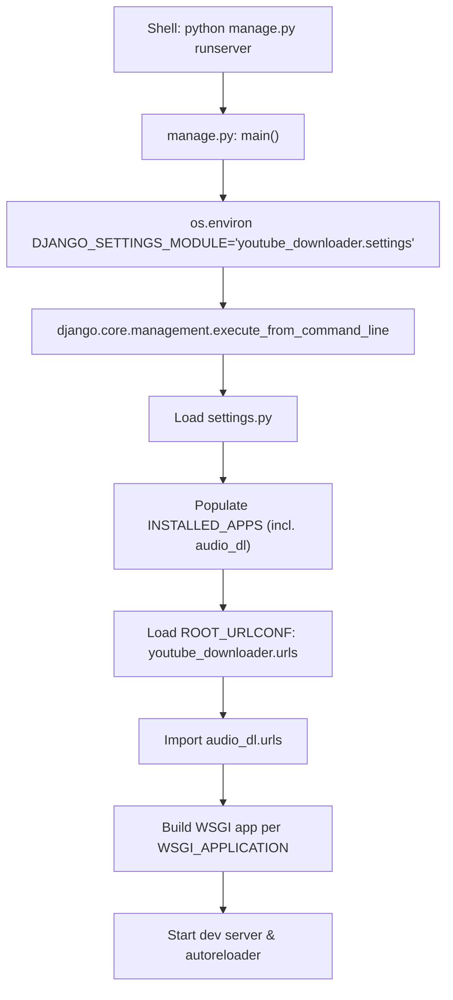

```mermaid
graph TD;
A["Shell: python manage.py runserver"] --> B["manage.py: main()"];
B --> C["os.environ DJANGO_SETTINGS_MODULE='youtube_downloader.settings'"];
C --> D["django.core.management.execute_from_command_line"];
D --> E["Load settings.py"];
E --> F["Populate INSTALLED_APPS (incl. audio_dl)"];
F --> G["Load ROOT_URLCONF: youtube_downloader.urls"];
G --> H["Import audio_dl.urls"];
H --> I["Build WSGI app per WSGI_APPLICATION"];
I --> J["Start dev server & autoreloader"]
```

